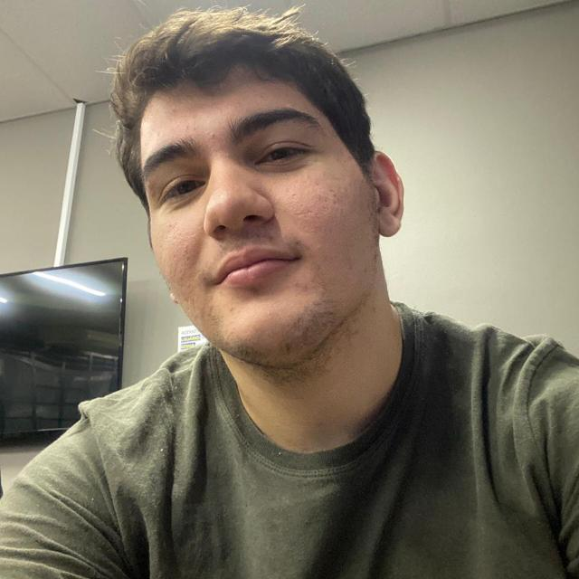
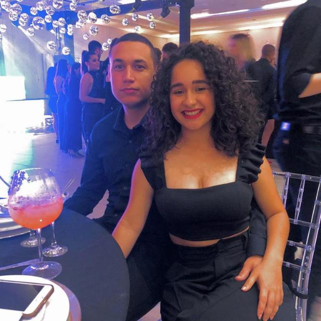
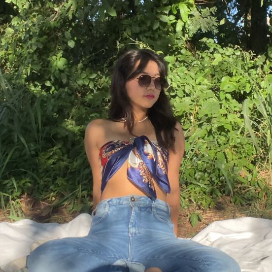
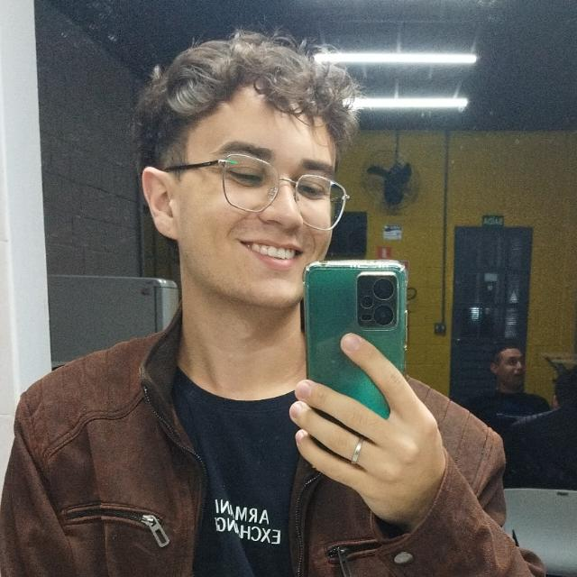

# Build My World


> The game "Mimic Sons" is a fun competition in which players take turns imitating different sounds, while the others try to guess. The design features a simple and pleasant interface, with features such as audio recording, random challenges and an interactive experience between participants. 

## 💻 Pré-requisitos

Antes de começar, verifique se você atendeu aos seguintes requisitos:

- Você instalou a versão mais recente de `<linguagem / dependência / requeridos>`
- Você tem uma máquina `<Windows / Linux / Mac>`. Indique qual sistema operacional é compatível / não compatível.
- Você leu `<guia / link / documentação_relacionada_ao_projeto>`.

## 🚀 Instalando Build My World

Para instalar, siga estas etapas:

Linux e macOS:

```
<comando_de_instalação>
```

Windows:

```
<comando_de_instalação>
```

## ☕ Usando Build My World

Para usar, siga estas etapas:

```
<exemplo_de_uso>
```

Adicione comandos de execução e exemplos que você acha que os usuários acharão úteis. Fornece uma referência de opções para pontos de bônus!


## 🤝 Collaborators

<table>
  <tr>
    <td align="center">
      <a href="https://github.com/itscaiocunha" title="Caio Cunha">
        <br>
        <sub>
          <b>Caio Cunha</b>
        </sub>
      </a>
    </td>
</table>
<table>
  <tr>
    <td align="center">
      <a title="Daniel Vanzela">
        <br>
        <sub>
          <b>Daniel Vanzela</b>
        </sub>
      </a>
    </td>
</table>
<table>
  <tr>
    <td align="center">
      <a title="Eduardo Riquena">
        <br>
        <sub>
          <b>Eduardo Riquena</b>
        </sub>
      </a>
    </td>
</table>
<table>
  <tr>
    <td align="center">
      <a title="Gian Freitas">
        <br>
        <sub>
          <b>Gian Freitas</b>
        </sub>
      </a>
    </td>
</table>
<table>
  <tr>
    <td align="center">
      <a title="Giovana Chiodeto">
        <br>
        <sub>
          <b>Giovana Chiodeto</b>
        </sub>
      </a>
    </td>
</table>
<table>
  <tr>
    <td align="center">
      <a title="Haryel Caliari">
        <br>
        <sub>
          <b>Haryel Caliari</b>
        </sub>
      </a>
    </td>
</table>
<table>
  <tr>
    <td align="center">
      <a title="Jackeline Ayumi">
        <br>
        <sub>
          <b>Jackeline Ayumi</b>
        </sub>
      </a>
    </td>
</table>
<table>
  <tr>
    <td align="center">
      <a title="Vinycius Oblonczyk">
        <br>
        <sub>
          <b>Vinycius Oblonczyk</b>
        </sub>
      </a>
    </td>
</table>

## 📝 License

This project is under license. See the file [LICENSE](LICENSE.md) for more details.