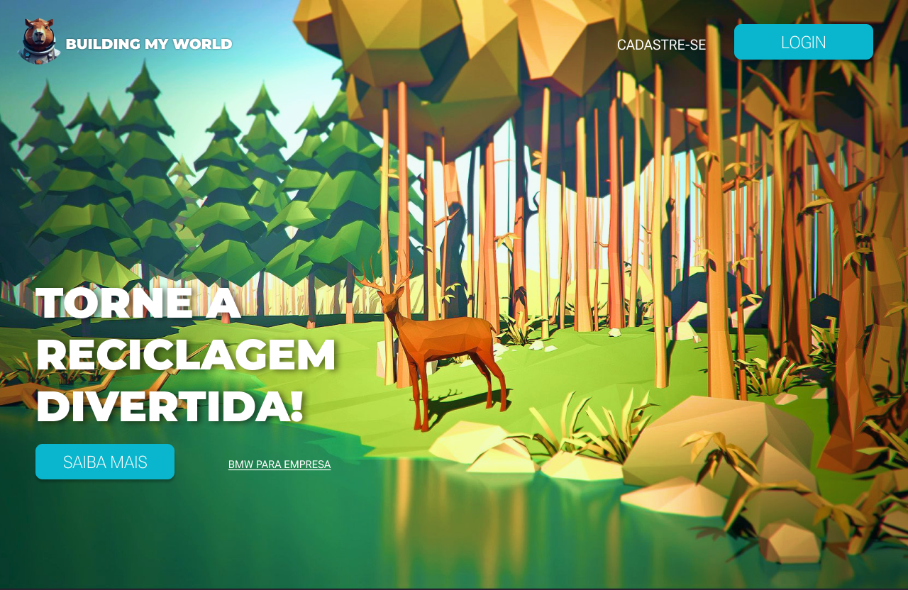
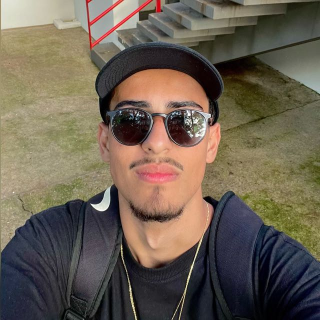

# Build My World




> Project developed in the fourth period of graduation whose objective was to develop a platform that was hosted in the cloud and that helped solve one of the UN SDGs. What resulted in a recycling, blood, clothes etc. donation game.

## 💻 Pré-requisitos

Antes de começar, verifique se você atendeu aos seguintes requisitos:

- Você instalou a versão mais recente de [Node.js](https://nodejs.org/) e o [npm](https://www.npmjs.com/).

## 🚀 Instalando Build My World

Para instalar, siga estas etapas:

Linux e macOS:

```
npm install
```

Windows:

```
npm install
```

## ☕ Usando Build My World

Para usar, siga estas etapas:

```
npm start
```


## 🖼️ Design

Confira o protótipo no [Figma](https://www.figma.com/file/zAgjtpFcLzY1yQX1bWKs8D/Build-My-World---Projeto-Integrado?type=design&node-id=0-1&mode=design&t=xTPdyioAhmxzupVD-0) para visualizar o design do projeto.

## 🤝 Collaborators

<table>
  <tr>
    <td align="center">
      <a href="#" title="Caio">
        <br>
        <sub>
          <b>Caio Cunha</b>
        </sub>
      </a>
    </td>
    <td align="center">
      <a href="#" title="Daniel">
        <br>
        <sub>
          <b>Daniel Vanzela</b>
        </sub>
      </a>
    </td>
    <td align="center">
      <a href="#" title="Eduardo">
        <br>
        <sub>
          <b>Eduardo Fonseca</b>
        </sub>
      </a>
    </td>
  </tr>
</table>

<table>
  <tr>
    <td align="center">
      <a href="#" title="Gian">
        <br>
        <sub>
          <b>Gian Freitas</b>
        </sub>
      </a>
    </td>
    <td align="center">
      <a href="#" title="Giovana">
        <br>
        <sub>
          <b>Giovana Chiodeto</b>
        </sub>
      </a>
    </td>
    <td align="center">
      <a href="#" title="Haryel">
        <br>
        <sub>
          <b>Haryel Caliari</b>
        </sub>
      </a>
    </td>
  </tr>
</table>
<table>
  <tr>
    <td align="center">
      <a href="#" title="Jackeline">
        <br>
        <sub>
          <b>Jackeline Ayumi</b>
        </sub>
      </a>
    </td>
    <td align="center">
      <a href="#" title="Viny">
        <br>
        <sub>
          <b>Vinycius Oblonczyk</b>
        </sub>
      </a>
    </td>
  </tr>
</table>


## 📝 License

This project is under license. See the file [LICENSE](LICENSE.md) for more details.
